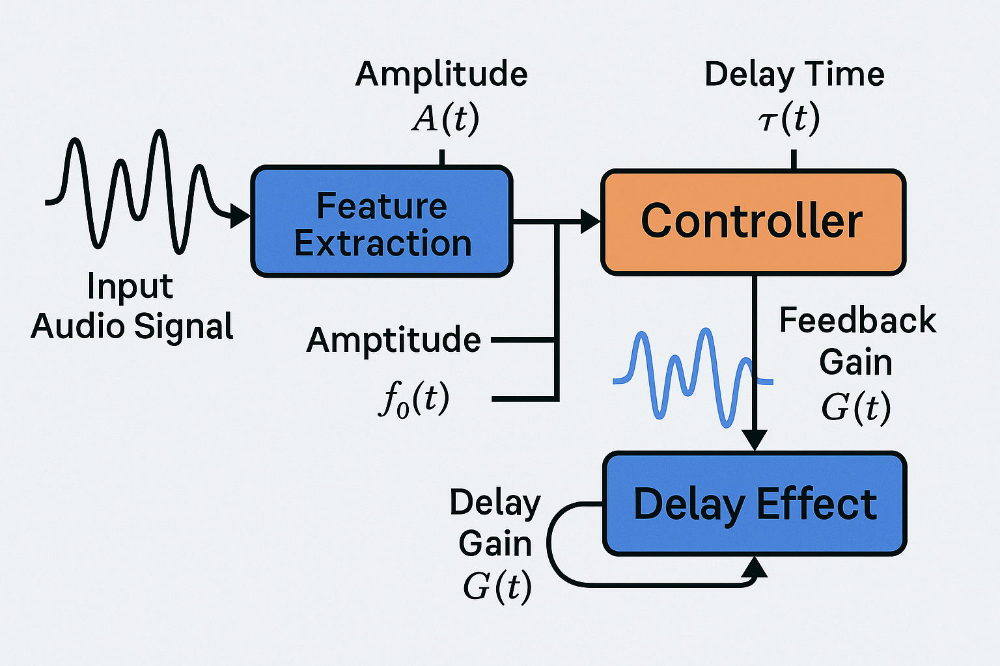

# 🎙️ Research Proposal: Feedback-Controlled Audio Effects Using Real-Time Signal Estimation

## Abstract

This project explores the use of real-time feedback control principles to develop **adaptive audio effects** for live vocals or instruments. Inspired by control systems theory, our aim is to enhance traditional delay and reverb effects by dynamically modulating parameters such as **feedback gain** and **delay time** based on **live signal characteristics**. This creates a more **expressive, responsive, and context-aware effect chain** suitable for performance or production.

## Motivation

Conventional audio effects often use static parameters that fail to adapt to performance dynamics. In live or improvisational settings, such rigidity limits expressiveness and can lead to sonic artifacts like excessive reverb or muddy feedback loops. By applying **feedback control** to the signal processing pipeline, we aim to create smarter effects that **respond to how the user plays or sings**.

## System Overview

The current implementation consists of a real-time system developed in Python using the `pyo` DSP engine. The architecture includes:

- **Feature Extraction Block**  
  Uses envelope following to estimate the input signal’s amplitude \( A(t) \) in real time.

- **Control Block**  
  A classic **PID controller** compares the estimated amplitude to a reference \( A_{\text{ref}} \), producing a feedback gain \( G(t) \). Simultaneously, a nonlinear mapping is used to compute a time-varying delay \( \tau(t) \) based on amplitude.

- **DSP Effect Block**  
  Applies the delay effect using the dynamically controlled feedback and delay time parameters:
  \[
  y(t) = x(t - \tau(t)) + G(t) \cdot y(t - \tau(t))
  \]

## Core Algorithms

### Amplitude Estimation
Using:
```python
amp = Follower(input_signal, freq=10)
````

To track the RMS envelope of the incoming signal.

### Feedback Gain Controller

A PID controller:

$$
e(t) = A_{\text{ref}} - A(t) \\
G(t) = K_p e(t) + K_i \int e(t)dt + K_d \frac{de(t)}{dt}
$$

Is used to dynamically tune the feedback gain in response to intensity changes.

### Adaptive Delay Time

A static mapping:

$$
\tau(t) = \text{clip}(0.8 - 0.6 \cdot A(t), 0.2, 0.8)
$$

Lengthens the delay at soft volumes and shortens it at loud volumes, emulating psychoacoustic sensitivity.

## Applications

* 🎤 **Vocals**: Add dynamic spaciousness that recedes during loud peaks and expands during quiet phrasing.
* 🎸 **Guitar or bass**: Prevent feedback buildup during solos while enhancing ambient texture during softer parts.
* 🎛️ **Live performance tools**: Allow performers to control delay depth expressively using only playing dynamics.

## Future Work

* 🔁 **Tempo synchronization** via onset detection
* 🔊 **Pitch tracking** for frequency-dependent feedback modulation
* 🧠 Integration with **machine learning** models for gesture- or genre-aware effects
* 🎚️ GUI or plugin export via JUCE / Streamlit

## Conclusion

This project presents a novel synthesis of **control engineering and audio signal processing**. By leveraging real-time feedback, we demonstrate that audio effects can become more musically aware and better aligned with human performance — paving the way for a new class of intelligent DSP tools.

---

## Author

**Adrian Guel**
Control Engineer • Audio Hacker • Educator
[github.com/AdrianGuel](https://github.com/AdrianGuel)

